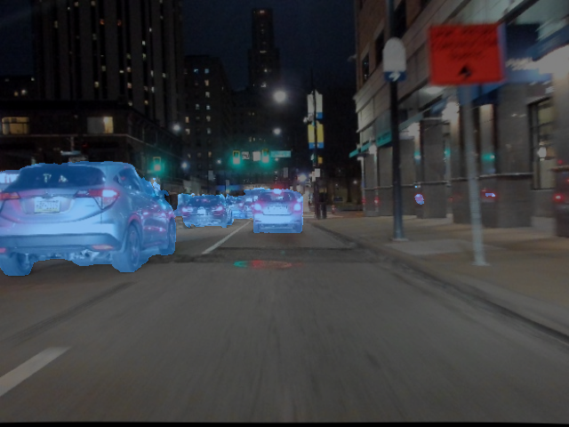
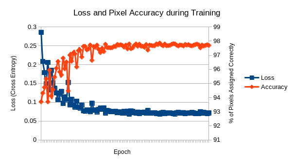
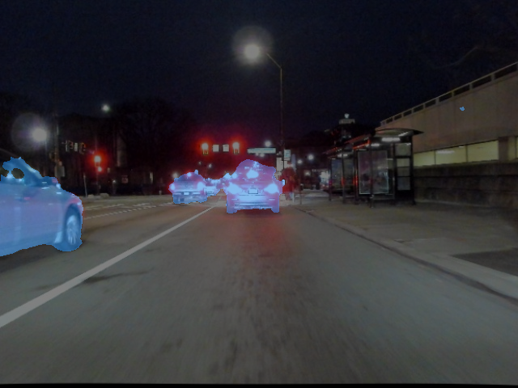

# 18744: Poor Lighting Segmentation
Introduction to Autonomous Driving - Project Topic 7: Computer Vision in Poor Lighting



## Dataset Download

```commandline
mkdir datasets/
cd datasets/
```

### MFNet Dataset
The MFNet dataset must be downloaded from Google Drive.  See the MFNet README for instructions.
Once the zip is in the datasets folder:
```commandline
unzip ir_seg_dataset.zip
```
Then open the folder and change line 5 of the make_flip.py file to:
```python
root_dir = './'
```
And run the flipping program
```commandline
python make_flip.py
```

### HeatNet Dataset
```commandline
mkdir heatnet_data/
cd heatnet_data/
wget http://aisdatasets.informatik.uni-freiburg.de/freiburg-thermal-segmentation/train.zip
wget http://aisdatasets.informatik.uni-freiburg.de/freiburg-thermal-segmentation/test.zip
unzip train.zip
unzip test.zip
```

### Our Dataset

Make a custom data folder within the datasets folder
```commandline
mkdir custom_data/
cd custom_data/
```

Download the [segmentation export](https://app.hasty.ai/projects/26cac049-ecb7-48f1-8776-201c38e81aab/edit/export)
```commandline
mkdir labels/
cd labels/
unzip 'name of segmentation export file'
```

Download our custom dataset (stored on Git LFS in the datacapture folder) and run the merge_data.py script in the datacapture folder
```commandline
cd foler_with_custom_dataset
mkdir merged
python merge_data.py
```

Finally, copy the merged output folder contents into a folder named rgba/ in the custom_data/ directory

## How to Run

In an environment with Python 3.7 installed, install all the dependency packages specified in the 'requirements.txt' file.

```commandline
pip install -r requirements.txt
```

### How to Train

After installing all of the pip dependencies specified in the requirements.txt file and downloading all of the datasets, training can be run using:
```commandline
python train.py
```


### How to Demo

Using pretrained weights, one can run the demo program on our testing data, which is presumed to be unzipped in the datacapture/ directory

```commandline
unzip collection1.zip
mkdir data/collection1
mv data/flir data/collection1
mv data/rgb data/collection1
python demo.py
```

